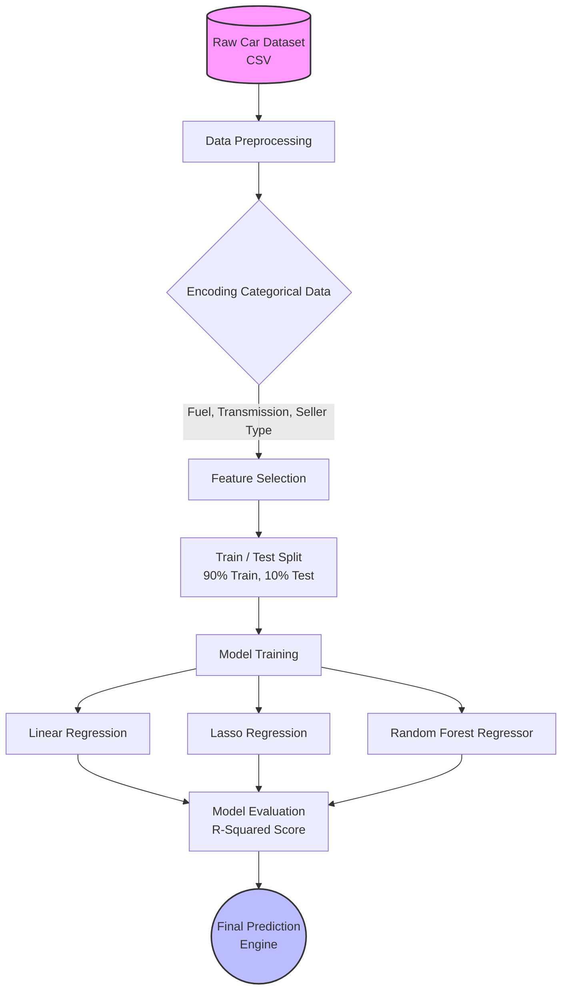

<h1 align="center">AutoOracle AI 🏎️🔮</h1>

<p align="center">
  <strong>A Machine Learning pipeline for predicting used car prices based on vehicle history, specifications, and market data.</strong>
</p>

<p align="center">
  
  
  
  
</p>

---

## 📌 Overview
**AutoOracle AI** is an end-to-end Machine Learning project designed to accurately estimate the selling price of used cars. By analyzing historical vehicle data, the model accounts for factors like depreciation (age), usage (kilometers driven), fuel type, and transmission.

## 🏗️ System Architecture

The following diagram illustrates the data flow and model training pipeline utilized in this project:



## 📊 The Dataset
The model is trained on a robust dataset containing the following features:
* **`Car_Name`**: The specific model of the vehicle.
* **`Year`**: The year the car was purchased.
* **`Selling_Price`**: Target Variable (The price the car sold for).
* **`Present_Price`**: The current ex-showroom price of the car.
* **`Kms_Driven`**: Total distance the car has been driven.
* **`Fuel_Type`**: Petrol, Diesel, or CNG.
* **`Seller_Type`**: Sold by a Dealer or Individual.
* **`Transmission`**: Manual or Automatic.
* **`Owner`**: Number of previous owners.

## 🧠 Models Evaluated
To find the most accurate predictor, multiple regression algorithms were evaluated:
1. **Linear Regression:** Establishes a baseline linear relationship between features and price.
2. **Lasso Regression:** Introduces L1 regularization to penalize less important features and prevent overfitting.
3. **Random Forest Regressor:** An ensemble learning method using multiple decision trees to capture non-linear relationships.

## 🚀 Setup & Installation

### Prerequisites
Make sure you have Python 3.8+ installed on your local machine.

### Installation Steps
1. **Clone the repository:**
   ```bash
   git clone https://github.com/SihanUdayaratna03/AutoOracle-AI.git
   cd AutoOracle-AI
   ```

2. **Create a virtual environment (Recommended):**
   ```bash
   python -m venv venv
   source venv/bin/activate  # On Windows use `venv\Scripts\activate`
   ```

3. **Install the dependencies:**
   ```bash
   pip install -r requirements.txt
   ```

4. **Launch the Notebook:**
   ```bash
   jupyter notebook
   ```
   Open `car-price-prediction.ipynb` in your browser to explore the code, train the models, and view the visualizations.

## 📜 License
This project is licensed under the MIT License - see the [LICENSE](LICENSE) file for details.
