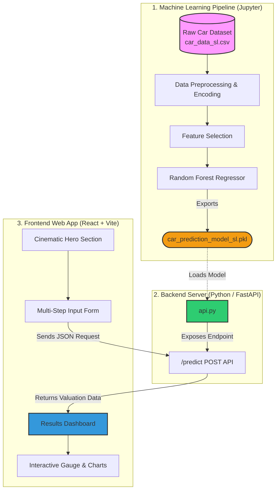

<h1 align="center">AutoOracle AI </h1>

<p align="center">
  <strong>A Premium, Full-Stack Machine Learning Pipeline & Web Application for predicting used car prices.</strong><br>
  <em>(Tailored for the Sri Lankan Automotive Market)</em>
</p>

<p align="center">
  
  
  
  
  
</p>

---

## 📖 Project Overview
**AutoOracle AI** is an end-to-end Machine Learning system designed to accurately estimate the fair market selling price of used cars. It calculates the intrinsic value of a vehicle based on its original ex-showroom price and applies complex, AI-driven depreciation factors based on age, mileage, fuel type, and transmission.

### 🇱🇰 Sri Lankan Market Adaptation
The data and models in this repository have been specifically calibrated for the **Sri Lankan market**. Historical vehicle data was scaled to account for the unique economic factors in Sri Lanka, including high import vehicle taxes (often 3x-4x base value) and LKR currency conversion rates, ensuring the predictions are highly realistic for local users.

---

## 🏗️ Full System Architecture

The project is split into three distinct layers:
1. **Machine Learning Pipeline:** Data preprocessing and model training.
2. **Backend API:** A REST API that serves the trained AI model.
3. **Frontend UI:** A cinematic, premium React web application.



---

## 🧠 How the AI Works

Unlike standard prediction models that rely on the vehicle's name (which causes issues with new, unseen cars), **AutoOracle AI relies entirely on the vehicle's "Current Ex-Showroom Price"**. 

1. **The Baseline:** The Ex-Showroom price acts as the ultimate proxy for the car's tier, luxury level, and brand value. 
2. **The Depreciation Engine:** The Random Forest algorithm uses the remaining features (Age, Kilometers Driven, Fuel Type, Transmission, Previous Owners) as complex **depreciation factors**.
3. **The Result:** By subtracting the AI-calculated depreciation from the baseline price, the model can accurately predict the value of *any* car in the world, even if that specific model wasn't in the training dataset!

---

## 💻 Installation & Setup Instructions

To run the full stack locally, you need two terminals: one for the Python Backend, and one for the React Frontend.

### Prerequisites
- Python 3.8+
- Node.js (v18 or higher)

### Step 1: Clone the Repository
```bash
git clone https://github.com/SihanUdayaratna03/AutoOracle-AI.git
cd AutoOracle-AI
```

### Step 2: Start the FastAPI Backend
Open your first terminal and run:
```bash
# Optional: Create and activate a virtual environment
python -m venv venv
source venv/bin/activate  # On Windows: venv\Scripts\activate

# Install Python requirements
pip install -r requirements.txt
pip install fastapi uvicorn

# Start the API server
python api.py
```
*The backend will now be running on `http://localhost:8000`*

### Step 3: Start the React + Vite Frontend
Open a **second, separate terminal** and run:
```bash
# Navigate into the frontend directory
cd car-ui

# Install Node modules
npm install

# Start the Vite development server
npm run dev
```
*The stunning frontend UI will now be accessible in your browser at `http://localhost:5173`!*

---

## 📄 License
This project is licensed under the MIT License - see the [LICENSE](LICENSE) file for details.
